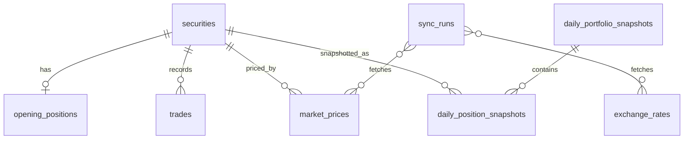

# StockPilot Architecture

## 0. 文档信息

- 产品名称：StockPilot
- 当前阶段：MVP 重构早期
- 关联文档：[PRD.md](./PRD.md)、[DESIGN.md](./DESIGN.md)
- 目标架构：Next.js + FastAPI + SQLite-first
- 技术目标：支持 Web 端和移动端响应式体验，同时保留 Python 在账本、估值、行情和历史补算上的优势。

## 1. 技术选型结论

StockPilot 从现在开始不再把 Streamlit 作为目标产品架构。Streamlit 只视为早期原型，用于理解现有能力和验证部分计算逻辑。

目标技术栈：

```text
Frontend:
  Next.js + React + TypeScript
  Responsive Web / PWA first

Backend:
  FastAPI
  Python domain services

Database:
  SQLite first
  PostgreSQL ready

Core:
  Ledger / Valuation / Market Data / Backfill
  Framework-independent Python modules
```

选择理由：

- Next.js / React 更适合长期 Web UI、移动端适配、组件复用和产品化体验。
- FastAPI 能保留当前 Python 核算逻辑，并提供清晰 API、类型校验和 OpenAPI 文档。
- SQLite 适合本地优先、单用户、低运维的个人账本工具。
- 通过 Repository / Service 边界预留 PostgreSQL，不在 MVP 期过早引入复杂数据库运维。

## 2. 架构原则

1. **账本为真相源**：证券、期初持仓和交易流水是系统唯一可信输入。
2. **估值可重建**：每日持仓快照和组合快照是派生结果，可从账本、行情和汇率重算。
3. **前后端分离**：前端只做交互和展示，后端负责数据、核算和补算。
4. **本地优先**：MVP 默认 SQLite 本地保存，不上传持仓、交易、成本和收益数据。
5. **可迁移数据库**：业务服务不直接依赖 SQLite 特性，为未来 PostgreSQL 做准备。
6. **统一人民币口径**：所有组合级指标、分布和趋势统一折算为 CNY。
7. **缺数据不伪造**：行情或汇率缺失时写入异常状态，不生成貌似准确的收益。
8. **Web/PWA 优先**：先做响应式 Web，移动端以 PWA / 手机浏览器体验为第一阶段目标。

## 3. 总体分层

```text
┌─────────────────────────────────────────────────────┐
│ Frontend                                             │
│ Next.js / React / TypeScript                         │
│ Pages, Components, Charts, Forms, PWA shell          │
├─────────────────────────────────────────────────────┤
│ API Layer                                            │
│ FastAPI routers, request/response schemas            │
├─────────────────────────────────────────────────────┤
│ Application Services                                 │
│ LedgerService, ValuationService, BackfillService     │
│ ImportExportService, ReportService, DataStatusService│
├─────────────────────────────────────────────────────┤
│ Domain Core                                          │
│ Moving-average ledger, Decimal valuation, allocation │
├─────────────────────────────────────────────────────┤
│ Infrastructure                                       │
│ Repositories, SQLite, market data adapters, backups  │
└─────────────────────────────────────────────────────┘
```

当前 Python 模块的迁移方向：

- `ledger.py` -> Domain + `LedgerService`
- `valuation.py` -> Domain + `ValuationService` + `BackfillService`
- `market_data.py` / `fetcher.py` -> Market data adapters
- `storage.py` -> Repository + migration + backup
- `report.py` / `templates/report.html` -> Report service
- `app.py` -> 原型参考，后续由 Next.js 前端替代
- `portfolio.py` -> 旧兼容层，后续下线

## 4. 目标目录结构

建议重构后的目录：

```text
stock_portfolio/
├── apps/
│   ├── web/                         # Next.js frontend
│   │   ├── app/
│   │   ├── components/
│   │   ├── lib/
│   │   └── package.json
│   └── api/                         # FastAPI backend
│       ├── main.py
│       ├── routers/
│       ├── schemas/
│       ├── services/
│       ├── domain/
│       ├── repositories/
│       ├── adapters/
│       └── migrations/
├── docs/
│   ├── PRD.md
│   ├── DESIGN.md
│   ├── ARCHITECTURE.md
│   └── TODO.md
├── data/
│   └── portfolio.db                 # local runtime db, gitignored
├── backups/                         # local db backups, gitignored
└── tests/
```

MVP 也可以先保持较轻目录，不必一步到位 monorepo 化，但前后端边界要从一开始建立。

## 5. 数据模型

### 5.1 核心实体

```text
Security
  id
  market: A / HK / US
  code
  name
  currency: CNY / HKD / USD
  industry
  industry_manual
  active

OpeningPosition
  id
  security_id
  start_date
  shares
  average_cost

Trade
  id
  security_id
  trade_date
  sequence
  side: BUY / SELL
  shares
  price
  reason_category
  note

MarketPrice
  security_id
  price_date
  close_price
  source
  status
  fetched_at

ExchangeRate
  currency
  rate_date
  cny_rate
  source
  status
  fetched_at

DailyPositionSnapshot
  snapshot_date
  security_id
  shares
  average_cost
  close_price
  cny_rate
  market_value_cny
  cost_value_cny
  unrealized_pnl_cny

DailyPortfolioSnapshot
  snapshot_date
  total_market_value_cny
  daily_pnl_cny
  cumulative_pnl_cny
  realized_pnl_cny
  unrealized_pnl_cny
  buy_flow_cny
  sell_flow_cny
  status
  is_final
  error_message
  calculated_at

SyncRun
  id
  started_at
  finished_at
  start_date
  end_date
  status
  details
```

说明：

- 金额、价格、汇率和股数在 Python 中使用 `Decimal`。
- SQLite 中继续以文本保存精确数值；API 输出时统一转为字符串或格式化数字，避免前端浮点误差。
- 行业属于 `Security`，不在每笔交易中重复保存。
- `Trade.reason_category` 和 `Trade.note` 是接下来必须补齐的字段。

### 5.2 数据关系



## 6. API 设计

API 使用 `/api/v1` 前缀。

### 6.1 Overview

```text
GET /api/v1/overview
```

返回：

- 总持仓成本
- 股票总市值
- 累计盈亏
- 累计收益率
- 今日盈亏
- 今日收益率
- 数据更新时间
- 数据状态

### 6.2 Holdings

```text
GET /api/v1/holdings
GET /api/v1/holdings/allocation/industry
GET /api/v1/holdings/allocation/market
PATCH /api/v1/securities/{security_id}/industry
```

返回当前持仓、行业分布和市场分布。

### 6.3 Trades

```text
GET /api/v1/trades
POST /api/v1/trades
PATCH /api/v1/trades/{trade_id}
DELETE /api/v1/trades/{trade_id}
POST /api/v1/trades/import
GET /api/v1/trades/export
```

交易写入后触发受影响日期之后的快照重算。

### 6.4 Analytics

```text
GET /api/v1/analytics/daily-returns
GET /api/v1/analytics/snapshots/{date}
GET /api/v1/analytics/value-trend
```

支持收益日历、每日盈亏柱状图和总市值趋势。

### 6.5 Data

```text
GET /api/v1/data/status
POST /api/v1/data/backfill
POST /api/v1/data/backup
GET /api/v1/report/html
```

用于数据状态、历史补算、数据库备份和 HTML 报告。

## 7. 核心流程

### 7.1 启动与补算

```text
FastAPI startup
  -> ensure_database()
  -> run migrations
  -> auto_backfill()
  -> write SyncRun
```

前端加载首页时读取：

```text
GET /overview
GET /analytics/daily-returns
GET /data/status
```

### 7.2 记录交易

```text
POST /trades
  -> validate input
  -> ledger.record_trade(...)
  -> valuation.rebuild_from(trade_date)
  -> return updated overview + trade
```

规则：

- 禁止卖出超过当时持仓。
- 同日多笔交易按 `sequence` 处理。
- 修改或删除历史交易后，从最早受影响日期重算。

### 7.3 每日收益

```text
每日盈亏 =
  当日股票总市值
  - 上一估值日股票总市值
  - 当日买入成交金额
  + 当日卖出成交金额
```

首个快照作为基线，`daily_pnl_cny = null`。

### 7.4 当前实时估值

```text
current_valuation()
  -> calculate_positions(today)
  -> fetch live prices / rates
  -> fallback to cached prices if needed
  -> return temporary valuation
```

当日盘中估值标记为临时数据，不覆盖正式历史快照。

## 8. 前端架构

Next.js 页面：

```text
/
  overview dashboard
/holdings
  holdings table/cards + allocation
/trades
  trade form + trade list
/analytics
  calendar + value trend + daily return
/settings
  securities, data status, backup, report
```

组件分层：

- `components/layout`：App shell、导航、移动端底部 Tab。
- `components/dashboard`：KPI、状态条、图表卡片。
- `components/holdings`：持仓表、移动端持仓卡片、行业/市场分布。
- `components/trades`：交易表单、交易流水、导入导出。
- `components/analytics`：收益日历、趋势图、明细面板。
- `components/ui`：Button、Card、Badge、Table、Dialog、Form。

状态策略：

- MVP 使用 React server/client fetch + 轻量本地 state。
- API 请求统一封装在 `lib/api.ts`。
- 表单校验使用前端 schema，并以后端校验为最终准则。

## 9. 数据库策略

MVP：

- SQLite 作为默认数据库。
- 数据库文件默认放在 `data/portfolio.db`。
- 本地备份放在 `backups/`。
- 使用 migration 脚本管理 schema。

PostgreSQL-ready 约束：

- 业务层不直接拼接复杂 SQLite 专有 SQL。
- Repository 封装数据访问。
- 时间统一 ISO 字符串或后续迁移为 timezone-aware datetime。
- Decimal 统一由 domain 层处理，数据库只负责持久化。
- 不在前端保存任何敏感账本状态。

未来切 PostgreSQL 的触发条件：

- 多用户账号体系。
- 云端同步。
- 多设备并发写入。
- 权限隔离。
- 更复杂的数据审计和任务队列。

## 10. 行情与汇率适配

目标适配策略：

- A 股历史行情：优先 AkShare。
- 港股历史行情：优先 AkShare，失败后尝试 yfinance。
- 美股历史行情：yfinance。
- 历史汇率：独立汇率适配器，短期使用 yfinance。
- 实时行情：统一封装到 market data adapter，不让前端直接调用行情源。

缓存策略：

- 历史行情写入 `market_prices`。
- 汇率写入 `exchange_rates`。
- 同一区间重复补算幂等。
- 外部数据源异常写入 `sync_runs.details`。

## 11. 错误与数据状态

状态类型：

- `ok`：快照完整可信。
- `incomplete`：缺少行情、汇率或估值失败。
- `partial`：同步任务部分日期成功、部分失败。
- `failed`：同步任务整体失败。

展示要求：

- 首页显示全局数据状态。
- 设置页展示完整同步记录和失败原因。
- 收益日历中异常日期明确标记。
- 缺失数据不参与伪准确收益展示。

## 12. 测试策略

后端 P0：

- 旧持仓迁移为期初持仓。
- 多次买入移动平均成本。
- 部分卖出已实现盈亏。
- 超额卖出拒绝。
- 买入/卖出现金流不误算为市场收益。
- 补算幂等。
- 行业分布之和等于总市值。
- 手动行业修改持久保存。

API P0：

- Overview API 返回一致口径。
- Trades API 新增、修改、删除后触发重算。
- Data status API 返回行情/汇率/补算状态。

前端 P0：

- 总览 KPI 展示正确。
- 持仓列表 Web 表格和移动端卡片可读。
- 交易表单基础校验可用。
- 收益日历和趋势图使用同一快照数据。

## 13. 当前差距

对照目标架构，当前实现还需：

1. 创建 FastAPI backend scaffold。
2. 创建 Next.js frontend scaffold。
3. 把现有 Python 核算模块迁入 backend domain/services。
4. 补齐交易理由和备注字段。
5. 建立 API schema 与路由。
6. 建立 SQLite migration 机制。
7. 将 Streamlit UI 替换为 Next.js 页面。
8. 补齐数据状态、导入导出、HTML 报告 API。
9. 补齐 Web 和移动端响应式页面。
10. 下线 `portfolio.py` 旧兼容层和 Streamlit 原型入口。

## 14. 演进顺序

建议开发顺序：

1. **搭建后端骨架**：FastAPI app、settings、database、health check。
2. **迁移领域服务**：ledger、valuation、market data、storage。
3. **补齐数据库迁移**：schema v3、交易理由、备注、data path。
4. **开放核心 API**：overview、holdings、trades、analytics、data status。
5. **搭建前端骨架**：Next.js、主题 token、导航、API client。
6. **实现核心页面**：总览、持仓、交易、收益分析、设置。
7. **导入导出与报告**：CSV、备份、HTML report。
8. **替换旧入口**：停止使用 Streamlit，保留必要迁移脚本。

## 15. 非目标

MVP 不设计：

- 券商账户连接。
- 多账户体系。
- 现金余额和资金流水。
- 手续费、分红、融资融券。
- 自动投资建议。
- 云端同步。
- 多用户权限。

这些能力如果未来加入，需要重新扩展账本模型、权限模型和估值口径，不能直接塞进当前 MVP。
